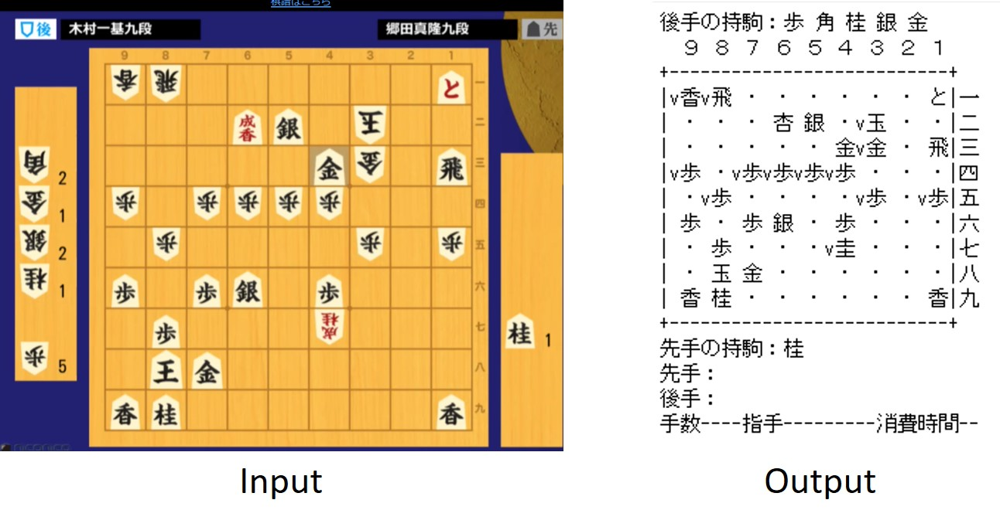

# shogi_kif_cv

電王盤の画像からShogiGUIに読み込める形式のテキストファイル（.kif）を生成する。  
cv2 のテンプレートマッチングで将棋盤・駒台上の駒を検出する。  
駒台に複数同じ駒がある場合は未対応（TOOD）。ひとつだけ駒が置かれている状態になるので、適宜ShogiGUIで編集してください。




## Requirements

### Windows

- Anaconds (for python3.6)
- chocolatey
- Git Bash

### Mac (not confirmed)

- pyenv
- virtualenv
- python3.6

## Setup

### Windows

In Anaconda Prompt:
```bash
conda create -n shogi pip=9.0 python=3.6
```

In Git Bash:
```bash
source activate  shogi
pip install -r requirements.txt
```

### Mac (not confirmed)

```bash
pyenv virtualenv shogi python=3.6
source ~/.pyenv/versions/shogi/bin/activate
pip install -r requirements.txt
```

## Quick Start

```bash
jupyter notebook
```

Open and run `notebooks/img2kif_example.ipynb`